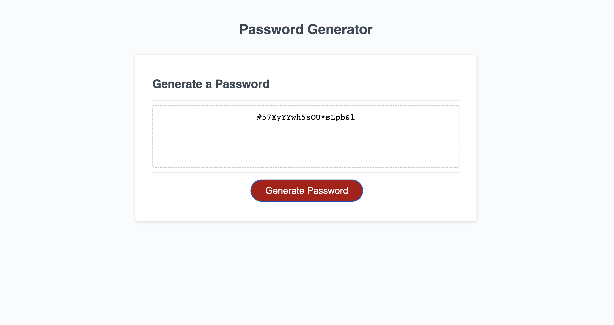

# Password Generator Starter Code

# <Password_generator>

## Description

- As a programmer, I wanted to create an application that an employee can use to generate a random password based on criteria they've selected.
- I built this application so that it will run in browser, and will feature dynamically updated HTML and CSS powered by JavaScript code.
- Writing this code gave me expierence learning how to apply javasript and to see how it manipulates functionaly to the user interface.
- While working on this project, I learned how to use the console to check for bugs and work them out. I also gained a basic understading of how to apply javascript such as using the javaScript HTML DOM EventListener & creating arrays. 

## Installation

To get the project up and running simply clone this Git Hub repository, then open index.html with a live server of choice.

## Usage

To use this password generator, click on the red tab that reads "Generate Password".
You will be prompted with qestions pertaining to how many characters you want your password to be, if you would like numbers in your password, if you would like uppercase letters in your password, if you would like lowercase leters in your password & if you would like special characters in your password. You can press ok or cancel for No. Once you are finnished answering the prompt questions, the password will be generated as shown below.

## Credits
Recieved starter code from Rutgers Bootcamp course.

